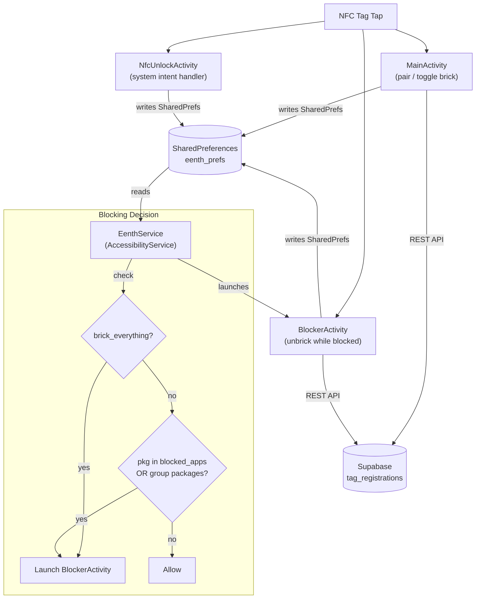

# Architecture — Eenth

## Overview

Eenth is a physical-first Android app blocker. It uses an NFC tag as a physical key to lock/unlock (brick/unbrick) access to selected apps on the user's phone.



## Components

### 1. MainActivity (`MainActivity.kt`)
The main entry point and configuration screen.

**Responsibilities:**
- Display brick/unbrick status (hero card with green/red state)
- NFC tag pairing and name management
- "Brick Everything" toggle
- App group management (presets + custom, with app icon grid detail)
- Individual app blocking (app list with toggle switches)
- NFC reader mode for brick/unbrick toggle

**UI Sections (top to bottom):**
1. Brand header ("eenth")
2. Hero status card (bricked/unbricked state, tag info, edit name)
3. Block Everything toggle card
4. Groups section (horizontal scrolling cards with overlapping app icons)
5. Apps section (vertical list with icons and switches)

### 2. EenthService (`EenthService.kt`)
An Android AccessibilityService — the core blocking engine.

**Responsibilities:**
- Monitor `TYPE_WINDOW_STATE_CHANGED` events
- Determine if the foreground app should be blocked
- Launch `BlockerActivity` for blocked apps
- Listen for state change broadcasts to update blocking behavior

**Blocking logic:**
```
if is_bricked:
    if brick_everything AND pkg not in allowlist → BLOCK
    else if pkg in blocked_apps OR pkg in selected group packages → BLOCK
else:
    ALLOW all
```

**Allowlist** (never blocked): SystemUI, launchers, settings, NFC services, Eenth itself.

### 3. BlockerActivity (`BlockerActivity.kt`)
Full-screen overlay shown when a blocked app is detected.

**Responsibilities:**
- Display "BRICKED" wall (brick emoji + message)
- NFC reader mode for direct unbrick (user taps tag on this screen)
- Verify tag UID against paired tag
- Broadcast state change on successful unbrick

### 4. NfcUnlockActivity (`NfcUnlockActivity.kt`)
Transparent activity that handles system NFC intent dispatch.

**Responsibilities:**
- Handle `TAG_DISCOVERED` and `TECH_DISCOVERED` intents
- Verify tag and unbrick if valid
- Fallback reader mode with `FLAG_READER_SKIP_NDEF_CHECK`

### 5. TagRepository (`TagRepository.kt`)
REST client for Supabase tag management.

**API Methods:**
| Method | Endpoint | Purpose |
|--------|----------|---------|
| `pairTag()` | POST `/tag_registrations` | Register tag UID + device ID |
| `verifyTag()` | GET `/tag_registrations?tag_uid=eq.{uid}` | Verify tag belongs to device |
| `unpairTag()` | DELETE `/tag_registrations?tag_uid=eq.{uid}` | Remove registration |
| `updateTagName()` | PATCH `/tag_registrations?tag_uid=eq.{uid}` | Update display name |
| `getRegistration()` | GET `/tag_registrations?tag_uid=eq.{uid}` | Fetch registration record |

**Supabase table: `tag_registrations`**
| Column | Type | Description |
|--------|------|-------------|
| `tag_uid` | text (PK) | NFC tag UID |
| `device_id` | text | Android `ANDROID_ID` |
| `paired_at` | timestamptz | Pairing timestamp |
| `tag_name` | text | User-defined name |

### 6. AppGroup & GroupManager (`AppGroup.kt`)

**AppGroup data class:**
```kotlin
data class AppGroup(
    val id: String,
    val name: String,
    val emoji: String,
    val packages: Set<String>,
    val isPreset: Boolean,
    var isSelected: Boolean = false
)
```

**GroupManager** provides:
- 5 preset groups: Social Media, Streaming, Messaging, Games, Shopping
- Custom group CRUD (stored as JSON in SharedPreferences)
- Per-group package customization (add/remove apps from any group)
- `getGroupBlockedPackages()` — union of all selected groups' packages

### 7. Adapters

**GroupAdapter** — Horizontal RecyclerView cards showing:
- Overlapping app icons (up to 4 with "+N" badge)
- Group name and app count
- Selection state (red border when active)

**AppListAdapter** — Vertical RecyclerView showing:
- App icon, name, and SwitchMaterial toggle
- Toggle callback updates `blocked_apps` in SharedPreferences

## Data Flow

### Bricking
```
User taps NFC tag on MainActivity
  → ReaderCallback.onTagDiscovered()
  → Verify tag UID matches paired_tag_id
  → Toggle is_bricked in SharedPreferences
  → Broadcast ACTION_STATE_CHANGED
  → EenthService receives broadcast
  → If bricked: starts blocking apps
  → If unbricked: sends ACTION_CLOSE_BLOCKER
```

### Blocking
```
Any app opens
  → AccessibilityEvent TYPE_WINDOW_STATE_CHANGED
  → EenthService.onAccessibilityEvent()
  → Check is_bricked
  → Check brick_everything / blocked_apps / group packages
  → If should block: startActivity(BlockerActivity)
```

## UI Theme
- Dark-only design (`bg_primary: #050505`, `bg_card: #111111`)
- Accent red: `#FF3B30` (used for bricked state, selected items)
- Accent green: `#30D158` (used for unbricked state)
- Custom drawables for cards, hero sections, status dots
- 8-bit pixel-art brick wall app icon

## Security Considerations
- Supabase anon key is embedded (public, row-level security on server)
- Tag verification is local-first (compares UID against SharedPreferences)
- No authentication layer — device ID (`ANDROID_ID`) is the identity
- AccessibilityService has broad permissions by design (required for blocking)
