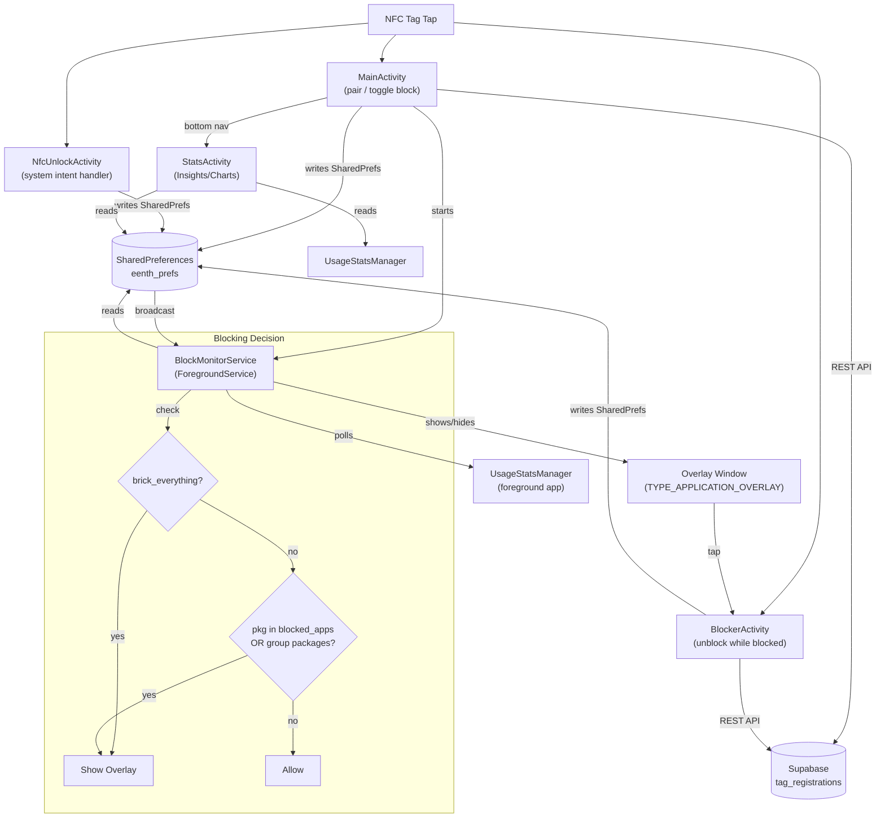
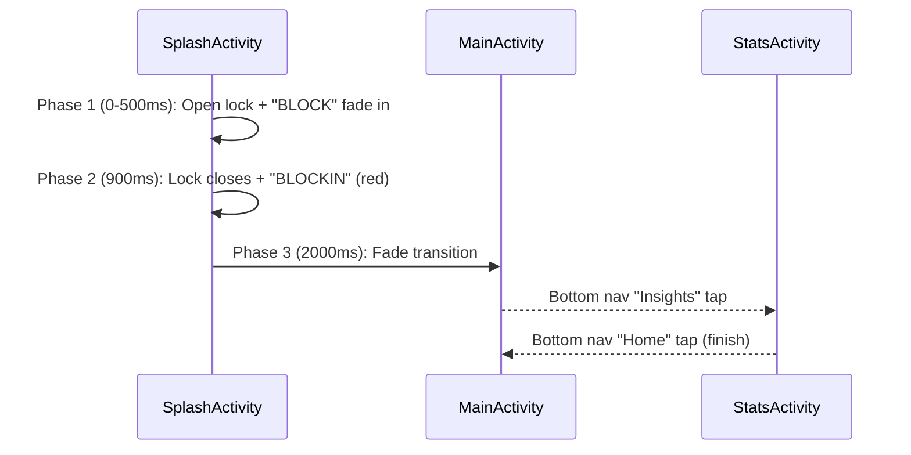

# Architecture — Block

## Overview

Block is a physical-first Android app blocker. It uses an NFC tag as a physical key to lock/unlock access to selected apps on the user's phone. The app is branded "BLOCK" (unblocked state) / "BLOCKIN" (blocked state, reads as "be lockin' in").



## App Launch Flow



## Components

### 1. SplashActivity (`SplashActivity.kt`)
Animated opening sequence with brand identity.

**Animation phases:**
1. **0–500ms:** Open lock icon scales in with OvershootInterpolator + "BLOCK" fades in (white)
2. **900ms:** Lock image swaps to closed + bounce animation + text fades to "BLOCKIN" (red #FF453A)
3. **2000ms:** Navigate to MainActivity with fade transition

### 2. MainActivity (`MainActivity.kt`)
The main entry point and configuration screen.

**Responsibilities:**
- Display block/unblock status (hero card with green/red state)
- Brand text transitions: "BLOCK" (white) ↔ "BLOCKIN" (red) based on state
- NFC tag pairing and name management
- "Block Everything" toggle (hides modes/apps sections when ON)
- App group management (presets + custom, with app icon grid detail)
- Individual app blocking (app picker bottom sheet)
- Focus timer display (H:MM:SS format, sans-serif-thin)
- NFC reader mode for block/unblock toggle
- Bottom navigation to StatsActivity
- Admin mode (7-tap brand logo → register approved tags)

**UI Sections (top to bottom):**
1. Brand header ("BLOCK" / "BLOCKIN" with state-based color)
2. Hero status card (status dot + label, timer 52sp, hint text)
3. Stats summary card (today's focus time + session count, clickable → StatsActivity)
4. Tag card (paired/unpaired state with name + repair/edit buttons)
5. Block Everything toggle (SwitchMaterial, hides below sections when ON)
6. Groups section (horizontal RecyclerView of group cards)
7. Blocked Apps section (programmatic icon grid + "Add Apps" button)
8. Bottom nav bar (Home active, Insights inactive)

**Key Constants:**
```kotlin
PREFS_NAME = "eenth_prefs"
KEY_BLOCKED_APPS, KEY_IS_BRICKED, KEY_BRICK_EVERYTHING
KEY_PAIRED_TAG_ID, KEY_TAG_NAME
KEY_BRICK_START_TIME, KEY_TODAY_FOCUS_MS, KEY_TODAY_SESSIONS, KEY_STAT_DATE
ACTION_STATE_CHANGED = "com.eenth.blocker.ACTION_STATE_CHANGED"
```

### 3. StatsActivity (`StatsActivity.kt`)
Dedicated Insights screen with usage analytics.

**Charts (MPAndroidChart v3.1.0):**
| Chart | Type | Data Source | Highlight |
|-------|------|-------------|-----------|
| Focus Time | BarChart (7 days) | SharedPreferences `focus_YYYY-MM-DD` | Green bar for today |
| Screen Time | Stacked BarChart (7 days) | UsageStatsManager | Per-app colored segments + legend |
| Pickups | BarChart (7 days) | UsageEvents KEYGUARD_HIDDEN | Orange bar for today |
| Top Apps | HorizontalBarChart | UsageStatsManager (today) | Top 6 apps with time labels |

**Screen Time stacked chart details:**
- Top 5 apps by weekly usage get distinct colors (red, orange, yellow, green, cyan)
- Remaining usage lumped as "Other" (dark gray)
- Legend with app names + colored circles at bottom
- Day labels show "Tue\n15" format

**Stats grid:** Screen time, Focus time, Pickups, Sessions (2x2)
**Streak:** Consecutive days with focus sessions

### 4. BlockMonitorService (`BlockMonitorService.kt`)
A ForegroundService that replaces the previous AccessibilityService approach. Polls the foreground app every 500ms using `UsageStatsManager` events and shows a full-screen overlay when a blocked app is detected.

**How it works:**
1. Runs as a ForegroundService with a persistent notification ("Block is active")
2. Every 500ms, queries `UsageEvents` for the last 5 seconds to find the current foreground app
3. If the foreground app should be blocked → shows a `TYPE_APPLICATION_OVERLAY` full-screen window
4. If the user navigates away or unblocks → hides the overlay

**Permissions required:**
- `SYSTEM_ALERT_WINDOW` ("Display over other apps")
- `PACKAGE_USAGE_STATS` ("Usage access")
- `FOREGROUND_SERVICE`
- `POST_NOTIFICATIONS` (Android 13+)

**Blocking logic:**
```
if is_bricked:
    if brick_everything AND pkg not in (systemAllowlist + paymentAllowlist) → SHOW OVERLAY
    else if pkg in blocked_apps OR pkg in selected group packages → SHOW OVERLAY
else:
    HIDE OVERLAY
```

**System allowlist** (never blocked): SystemUI, launchers, settings, NFC services, Block itself.
**Payment allowlist** (never blocked in brick_everything): Google Pay, Paytm, PhonePe, UPI, Amazon, MobiKwik, Samsung Pay, Play Store.

### 5. BlockerActivity (`BlockerActivity.kt`)
Activity for NFC unblock — launched when user taps the overlay.

- Displays "BLOCKED" wall
- NFC reader mode for direct unblock (user taps tag on this screen)
- Verifies tag UID against paired tag
- Broadcasts state change on successful unblock

### 6. NfcUnlockActivity (`NfcUnlockActivity.kt`)
Transparent activity handling system NFC intent dispatch (`TAG_DISCOVERED`, `TECH_DISCOVERED`).

### 7. TagRepository (`TagRepository.kt`)
REST client for Supabase tag management.

**API Methods:**
| Method | Endpoint | Purpose |
|--------|----------|---------|
| `pairTag()` | POST `/tag_registrations` | Register tag UID + device ID |
| `verifyTag()` | GET `/tag_registrations?tag_uid=eq.{uid}` | Verify tag belongs to device |
| `unpairTag()` | DELETE `/tag_registrations?tag_uid=eq.{uid}` | Remove registration |
| `updateTagName()` | PATCH `/tag_registrations?tag_uid=eq.{uid}` | Update display name |

**Supabase table: `tag_registrations`**
| Column | Type | Description |
|--------|------|-------------|
| `tag_uid` | text (PK) | NFC tag UID |
| `device_id` | text | Android `ANDROID_ID` |
| `paired_at` | timestamptz | Pairing timestamp |
| `tag_name` | text | User-defined name |

### 8. AppGroup & GroupManager (`AppGroup.kt`)

**5 Preset groups:** Social Media, Streaming, Messaging, Games, Shopping
**Custom groups:** User-created, stored as JSON in SharedPreferences
**Per-group package customization:** Add/remove apps from any group

### 9. EenthTile (`EenthTile.kt`)
Quick Settings tile for toggling block state without opening the app.

## Data Flow

### Blocking
```
User taps NFC tag on MainActivity
  → ReaderCallback.onTagDiscovered()
  → Verify tag UID matches paired_tag_id
  → Toggle is_bricked in SharedPreferences
  → Update brand text (BLOCK ↔ BLOCKIN)
  → Broadcast ACTION_STATE_CHANGED
  → EenthService receives broadcast
  → If blocked: starts blocking apps
  → If unblocked: sends ACTION_CLOSE_BLOCKER
```

### Focus Tracking
```
On block:
  → Save brick_start_time = System.currentTimeMillis()
  → Increment today_sessions
  → Start timer (Handler, 1s ticks, H:MM:SS display)

On unblock:
  → Calculate elapsed = now - brick_start_time
  → Add to today_focus_ms
  → Archive to focus_YYYY-MM-DD (for weekly chart)
  → Stop timer
```

## UI Theme & Assets

### Colors
| Token | Hex | Usage |
|-------|-----|-------|
| `bg_primary` | #000000 | App background |
| `bg_card` | #0A0A0A | Card backgrounds |
| `bg_card_elevated` | #111111 | Elevated cards |
| `text_primary` | #FFFFFF | Main text |
| `text_secondary` | #8E8E93 | Secondary text |
| `text_tertiary` | #48484A | Muted text, inactive nav |
| `accent_red` | #FF453A | Blocked state, BLOCKIN brand |
| `accent_green` | #32D74B | Unblocked state, focus charts |
| `accent_orange` | #FF9F0A | Warnings, pickups chart |
| `divider` | #1C1C1E | Borders, chart grid lines |

### Drawables
- `ic_launcher_foreground.xml` — White padlock on dark background (app icon)
- `ic_lock_open.xml` — Open padlock (splash animation start)
- `ic_lock_splash.xml` — Closed padlock (splash animation end)
- `ic_nav_home.xml` — House icon for bottom nav
- `ic_nav_insights.xml` — Bar chart icon for bottom nav
- `bg_hero_default.xml` — Hero card normal state (dark, subtle border)
- `bg_hero_bricked.xml` — Hero card blocked state (red-tinted border)
- `bg_card.xml` — Standard card background (rounded 16dp)
- `bg_bar_today.xml` — Green rounded bar for today's chart value
- `bg_bar_default.xml` — Gray bar for other days

### Bottom Navigation
Both MainActivity and StatsActivity have a mirrored bottom nav bar:
- Thin divider line on top (`divider` color)
- Two tabs: Home (house icon) + Insights (bar chart icon)
- Active tab: white icon + bold label | Inactive: gray (#48484A)
- Extra bottom padding (28dp) for gesture navigation

## Website (`website/`)
React + Vite landing page for marketing.

**Components:**
- `Hero.jsx` — Main hero section
- `BuySection.jsx` — Purchase CTA
- `HowItWorks.jsx` — Step-by-step explanation
- `Modes.jsx` — Blocking modes explanation
- `FAQ.jsx` — Common questions
- `Testimonials.jsx` — User reviews
- `Comparison.jsx` — vs other app blockers
- `Navbar.jsx` + `Footer.jsx` — Layout

**Stack:** React, Vite, deployed separately from the Android app.

## Security Considerations
- Supabase anon key is embedded (public, row-level security on server)
- Tag verification is local-first (compares UID against SharedPreferences)
- No authentication layer — device ID (`ANDROID_ID`) is the identity
- AccessibilityService has broad permissions by design (required for blocking)
- Internal package name remains `com.eenth.blocker` (preserving existing installs)
